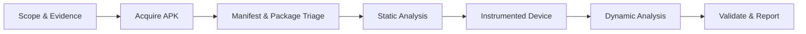

# Android Pentesting

Practical notes for authorized Android application assessments. The workflow
below follows the same rhythm as a real review: understand the package, map
the attack surface, inspect the code and manifest, observe the running app,
then validate only the findings that are in scope.

!!! warning "Authorization first"
    Use these commands and techniques only against applications, devices, and
    environments you own or have explicit permission to test. Treat extracted
    credentials, tokens, personal data, and production traffic as sensitive.

## Quick start



### Assessment flow

1. Record the package name, version, build type, signing certificate, target
	 SDK, test accounts, and device or emulator state.
2. Triage the APK with `apkanalyzer`, `aapt2`, `apktool`, `jadx`, and MobSF.
3. Read `AndroidManifest.xml` before reading application code. Exported
	 components, permissions, providers, intent filters, backup settings, and
	 network policy define much of the attack surface.
4. Search source, resources, native libraries, and bundled JavaScript for
	 secrets, URLs, crypto misuse, WebView sinks, and trust decisions.
5. Run the app on a dedicated test device. Capture logcat, filesystem changes,
	 network traffic, IPC behavior, and authentication state transitions.
6. Reproduce each issue with the smallest reliable proof and record impact,
	 preconditions, affected version, evidence, and remediation.

## Android security model

### App components

| Component | What it does | What to test |
| --- | --- | --- |
| Activity | A user-facing screen or flow | Exported status, intent extras, task affinity, authentication gates |
| Service | Background or long-running work | Exported services, caller permissions, exposed actions |
| BroadcastReceiver | Receives system or app events | Spoofed broadcasts, sensitive extras, exported receivers |
| ContentProvider | Shares structured data through `content://` URIs | Read/write permissions, path traversal, SQL injection, URI grants |
| Intent | Message used to start components or request actions | Explicit vs implicit routing, untrusted extras, deep links, redirection |

An app normally runs under its own Linux UID and private data directory. That
sandbox is weakened by exported components, world-readable files, unsafe URI
grants, shared storage, debuggable builds, or overly broad providers.

### Runtime and bytecode

- **DEX** is the compiled bytecode format inside an APK.
- **ART** is the Android Runtime used by modern Android releases. Dalvik was
	replaced by ART in Android 5.0.
- **Smali** is an assembly-like representation of DEX instructions.
- The usual flow is `Java/Kotlin -> .class -> .dex -> ART -> Android`.
- **JADX** produces readable Java-like output for review.
- **Apktool** decodes resources and produces Smali, then rebuilds an APK.
- Native code lives in architecture-specific `.so` files under `lib/`.

### APK anatomy

| Path | Contents | Review focus |
| --- | --- | --- |
| `AndroidManifest.xml` | Components, permissions, metadata | Exported attack surface and security configuration |
| `classes.dex` | Compiled application code | Business logic, secrets, crypto, trust decisions |
| `classesN.dex` | Additional DEX files | Multi-DEX applications and hidden code paths |
| `res/` | Resources and XML | URLs, keys, network security config, exported data |
| `assets/` | App-provided files and bundles | Hybrid JavaScript, certificates, configuration |
| `resources.arsc` | Compiled resources | Values not obvious in source output |
| `lib/` | Native shared objects | JNI boundaries, strings, native secrets |
| `META-INF/` | APK signing metadata | Signature and certificate evidence |

## Toolkit and setup

### Core tools

| Tool | Purpose |
| --- | --- |
| `adb` | Communicate with a device or emulator |
| `jadx` / `jadx-gui` | Decompile DEX/APK into readable Java-like code |
| `apktool` | Decode and rebuild resources and Smali |
| `apksigner` / `zipalign` | Align and sign test APKs after modification |
| MobSF | Automated static and dynamic triage |
| Frida | Runtime instrumentation and method tracing |
| objection | Frida-based interactive mobile exploration |
| Burp Suite | HTTP/S interception and request manipulation |
| `sqlite3` | Inspect extracted SQLite databases |
| Ghidra | Review native libraries when deeper reversing is required |

### Verify the device

```bash
adb devices
adb shell getprop ro.product.cpu.abi
adb shell getprop ro.build.version.release
adb shell getenforce
adb shell ip route
```

Use a dedicated emulator or test device. Record whether it is rooted, whether
SELinux is enforcing, the Android version, and the CPU ABI before installing
instrumentation. Choose the Frida server build that matches the device ABI and
the Frida client version.

### Install and inspect an APK

```bash
adb install app.apk
adb shell pm list packages -3
adb shell pm path com.example.app
adb shell dumpsys package com.example.app
adb shell monkey -p com.example.app -c android.intent.category.LAUNCHER 1
adb uninstall com.example.app
```

```bash
# Decode resources and Smali
apktool d app.apk -o app-decoded

# Decompile DEX into Java-like source
jadx -d app-jadx app.apk

# Inspect signing information
apksigner verify --verbose --print-certs app.apk

# Inspect the archive without extracting it
unzip -l app.apk
```

## Manifest triage

Read these attributes and declarations first:

| Manifest item | Why it matters |
| --- | --- |
| `android:exported` | Makes activities, services, and receivers callable by other apps |
| `android:permission` | Defines the permission required to reach a component |
| `android:debuggable` | Allows debugging interfaces and should be disabled in production |
| `android:allowBackup` | Can permit backup or data extraction depending on OS and backup rules |
| `android:dataExtractionRules` | Controls newer backup and transfer behavior |
| `android:usesCleartextTraffic` | Allows unencrypted HTTP traffic when enabled |
| `android:networkSecurityConfig` | Selects custom trust anchors, cleartext rules, and debug overrides |
| `<queries>` | Declares package visibility and app interaction requirements |
| Intent filters | Define implicit entry points and deep links |

Useful checks:

```bash
# Decode the binary manifest before reviewing it
apktool d app.apk -o app-decoded
grep -RniE 'exported|allowBackup|debuggable|networkSecurityConfig|usesCleartextTraffic' app-decoded/AndroidManifest.xml

# List likely components and intent filters
grep -RniE '<activity|<service|<receiver|<provider|<intent-filter|<data' app-decoded/AndroidManifest.xml

# Ask the device for the installed package configuration
adb shell dumpsys package com.example.app
```

Do not treat `exported=true` as automatically exploitable. Confirm that the
component performs a sensitive action and that no effective permission or
authentication check protects it. Likewise, `allowBackup=true` is a review
signal, not proof that data can be extracted on every Android version.

## Static analysis

### Secrets and sensitive strings

Search decompiled code, resources, assets, and native libraries for:

- API keys, access tokens, passwords, private keys, and database credentials
- Internal hostnames, IP addresses, debug endpoints, and Firebase URLs
- Encryption keys, initialization vectors, salts, and signing material
- PII, test accounts, verbose error messages, and feature flags

```bash
grep -RniE 'password|passwd|secret|token|apikey|api_key|bearer|firebaseio|http://' app-jadx/ app-decoded/
find app-decoded/lib -type f -name '*.so' -exec strings {} \; | grep -Ei 'token|secret|key|http'
```

A string found in an APK is not automatically a live credential. Verify scope,
permissions, expiry, and whether the value is only a public identifier. Never
publish live secrets in a report or commit them to this knowledge base.

### Cryptography review

Look for:

- ECB mode, DES/3DES, MD5 or SHA-1 used for security decisions
- Hardcoded keys or IVs, static salts, predictable random values, or XOR
- Keys stored in preferences, databases, logs, or external storage
- Custom encryption where authenticated standard primitives would be safer
- Encryption without integrity protection or weak key derivation

```bash
grep -RniE 'Cipher\.getInstance|SecretKeySpec|IvParameterSpec|SecureRandom|MessageDigest|AES/ECB|DES|MD5|SHA-1|Base64' app-jadx/
```

### Hybrid and native apps

For Flutter, React Native, Cordova, and other hybrid apps, inspect:

```text
assets/index.android.bundle
assets/flutter_assets/
lib/*/*.so
```

```bash
# JavaScript bundle review
js-beautify app-decoded/assets/index.android.bundle -o bundle.js

# Identify native strings
find app-decoded/lib -type f -name '*.so' -exec strings {} \; > native-strings.txt
grep -Ei 'https?://|token|secret|firebase|password' native-strings.txt
```

Hermes bundles may require a Hermes-compatible decompiler. Treat decompiled
output as an aid: validate important behavior at runtime.

### WebView review

Flag these patterns for closer review:

```java
webView.getSettings().setJavaScriptEnabled(true);
webView.loadUrl(userControlledUrl);
webView.addJavascriptInterface(nativeBridge, "bridge");
settings.setAllowUniversalAccessFromFileURLs(true);
```

Check URL allowlists, navigation handling, JavaScript bridges, file access,
mixed content, intent launches, and whether sensitive tokens are exposed to the
page. `addJavascriptInterface` is especially risky when attacker-controlled
content can reach the WebView; the actual impact depends on API level and the
annotated bridge methods.

### Obfuscation and integrity

R8/ProGuard obfuscation raises the cost of reversing but does not protect
secrets embedded in the client. Check whether the app detects repackaging,
unexpected signing certificates, tampered resources, or debugger attachment.
Document both the protection and the bypass conditions rather than calling
obfuscation a complete security control.

## Dynamic analysis

### Filesystem and local storage

The primary private data directory is usually:

```text
/data/data/<package>/
```

Review these locations on an authorized rooted test device or through an
approved backup/debug workflow:

| Location | Typical contents |
| --- | --- |
| `databases/` | SQLite databases and journals |
| `shared_prefs/` | XML preferences, tokens, flags |
| `files/` | App-created files and exports |
| `cache/` | Temporary data and downloaded content |
| `/sdcard/Android/data/<package>/` | External app data and caches |

```bash
adb shell 'su -c "find /data/data/com.example.app -maxdepth 2 -type f -print"'
adb pull /data/data/com.example.app/databases ./evidence/databases
adb pull /data/data/com.example.app/shared_prefs ./evidence/shared_prefs
sqlite3 ./evidence/databases/app.db '.tables'
sqlite3 ./evidence/databases/app.db "SELECT name FROM sqlite_master WHERE type='table';"
```

Look for plaintext credentials, tokens, health or payment data, unencrypted
backups, predictable filenames, insecure temporary files, and sensitive data
in external storage. Preserve hashes and access logs for evidence handling.

### Logging and screenshots

```bash
adb logcat -c
adb logcat | grep -iE 'password|token|secret|authorization|session'
```

Check logcat, crash reports, clipboard behavior, recent-app previews, and
screenshots for sensitive content. Sensitive screens may use
`WindowManager.LayoutParams.FLAG_SECURE`; verify the behavior rather than
assuming it is enabled.

### Root and emulator checks

For assessment of an app's resilience controls, document checks for:

```bash
adb shell 'which su'
adb shell 'which busybox'
adb shell getprop | grep -Ei 'test-keys|generic|goldfish|emulator|sdk'
```

Detection is a defense-in-depth signal, not a substitute for server-side
authorization. Any bypass testing belongs on a disposable test build or an
explicitly authorized target.

## Network interception

### Burp proxy with ADB

```bash
# Set a global proxy for a test device
adb shell settings put global http_proxy <proxy-ip>:8080

# Clear it after testing
adb shell settings put global http_proxy :0
# Or remove individual settings when required
adb shell settings delete global http_proxy
adb shell settings delete global global_http_proxy_host
adb shell settings delete global global_http_proxy_port
```

Configure Burp to listen on the host interface reachable by the device. Install
the CA only on the dedicated test device. Android versions and app network
security policies differ: a user-installed CA may not be trusted by an app, and
certificate pinning can reject an otherwise valid proxy certificate.

### Certificate pinning

First identify the failure in logs and code:

```text
Trust anchor for certification path not found
SSLPeerUnverifiedException
Certificate pinning failure
```

Then determine the implementation: Network Security Config, OkHttp
`CertificatePinner`, a custom `TrustManager`, native TLS, or a hybrid runtime.
For authorized testing, prefer a debug build with pinning disabled or a test
certificate. Runtime instrumentation or a rebuilt APK should be isolated to the
assessment environment and clearly recorded in evidence.

## IPC, intents, and deep links

### Activities, services, and receivers

Enumerate declared components and test their trust boundaries:

```bash
adb shell dumpsys package com.example.app | grep -Ei 'Activity|Service|Receiver|Provider|exported|permission'

# Launch a known test activity
adb shell am start -n com.example.app/.TestActivity

# Send a test broadcast with controlled values
adb shell am broadcast -a com.example.app.TEST -e value test
```

Check whether untrusted callers can trigger privileged actions, supply
arbitrary file paths or URLs, bypass authentication state, or cause sensitive
data to be returned. Test permission enforcement with a caller that does not
hold the app's signature-level permission.

### Content providers

```bash
# Read-only tests against an in-scope provider
adb shell content query --uri content://com.example.app.provider/items
adb shell content query --uri content://com.example.app.provider/items/1
```

Review URI path validation, projection and selection handling, read/write
permissions, temporary URI grants, and whether provider errors leak schema or
filesystem details. Avoid destructive `insert`, `update`, or `delete` tests
unless the test plan explicitly permits them and data can be restored.

### Deep links and intent redirection

```bash
adb shell am start -W -a android.intent.action.VIEW \
	-d 'myapp://example.test/account?next=/dashboard'
```

Test scheme and host validation, authentication requirements, redirect targets,
token exposure, and whether an implicit intent can be intercepted by another
application. Review `PendingIntent.getActivity`, `getService`, and
`getBroadcast` call sites for confused-deputy and mutability problems.

## Frida and runtime instrumentation

### Start Frida on a test device

```bash
adb push frida-server /data/local/tmp/frida-server
adb shell 'chmod 755 /data/local/tmp/frida-server'
adb shell '/data/local/tmp/frida-server >/dev/null 2>&1 &'

frida-ps -U
frida-ps -Uai
frida -U -f com.example.app -l script.js
```

### Basic Java hook

```javascript
Java.perform(function () {
	const Target = Java.use('com.example.app.Target');

	Target.method.overload('java.lang.String').implementation = function (value) {
		console.log('method input: ' + value);
		const result = this.method(value);
		console.log('method output: ' + result);
		return result;
	};
});
```

Use overload-aware hooks and preserve the original behavior unless the test
case specifically requires a controlled return value. Keep scripts small,
versioned, and tied to an evidence item.

### Discovery and tracing

```bash
frida-discover -U -f com.example.app -o discovered.txt
frida-trace -U -f com.example.app -j 'com.example.app!*'
frida-trace -U -f com.example.app -i 'open*'
```

Useful targets include authentication decisions, crypto boundaries, storage
APIs, WebView navigation, certificate validation, biometric callbacks, and
signature checks. Instrumentation can change timing and behavior, so confirm a
finding with a second observation where practical.

## Focused vulnerability checklist

### Configuration and packaging

- [ ] Production build is not `debuggable`.
- [ ] Backup and data extraction rules exclude sensitive data.
- [ ] Cleartext traffic is disabled unless explicitly required.
- [ ] Exported components have a documented reason and effective permission.
- [ ] Release APK uses the expected signing certificate and schemes.
- [ ] Sensitive screens resist screenshots and recent-task previews.
- [ ] Release logging does not expose credentials, tokens, or PII.

### Authentication and authorization

- [ ] Server-side authorization remains effective if client checks are bypassed.
- [ ] Tokens expire, rotate, and are not stored in plaintext.
- [ ] Biometric authentication gates a server-backed or keystore-backed action.
- [ ] Deep links cannot skip login or redirect to attacker-controlled targets.
- [ ] Exported IPC components do not perform privileged actions for arbitrary callers.

### Data protection

- [ ] SharedPreferences, SQLite, caches, backups, and external storage are reviewed.
- [ ] Keys are generated and stored with Android Keystore where appropriate.
- [ ] Cryptography uses current authenticated primitives and secure randomness.
- [ ] Temporary files and logs do not retain sensitive values.
- [ ] FileProvider paths are narrow and URI grants are temporary and scoped.

### Network and code

- [ ] TLS validation is present and pinning behavior is understood.
- [ ] WebViews restrict navigation, file access, JavaScript bridges, and mixed content.
- [ ] Native and bundled code do not contain live secrets.
- [ ] Repackaging and signature changes are detected where required.
- [ ] Third-party SDKs are inventoried and kept current.

## Reporting template

For every confirmed issue, capture:

```text
Title:
Severity and rationale:
Affected package/version:
Preconditions:
Component or code location:
Reproduction steps:
Observed result:
Security impact:
Evidence files and hashes:
Recommended remediation:
Retest criteria:
```

Avoid including real secrets in screenshots, commands, or writeups. Redact
tokens while preserving enough context to prove where they were exposed.

## References

- [OWASP Mobile Application Security](https://mas.owasp.org/)
- [OWASP MASVS](https://mas.owasp.org/MASVS/)
- [OWASP MASTG](https://mas.owasp.org/MASTG/)
- [Android Developers: App security](https://developer.android.com/privacy-and-security/security-tips)
- [Android Developers: App manifest](https://developer.android.com/guide/topics/manifest/manifest-intro)
- [Frida documentation](https://frida.re/docs/)
- [JADX](https://github.com/skylot/jadx)
- [Apktool](https://apktool.org/)
- [MobSF](https://github.com/MobSF/Mobile-Security-Framework-MobSF)
