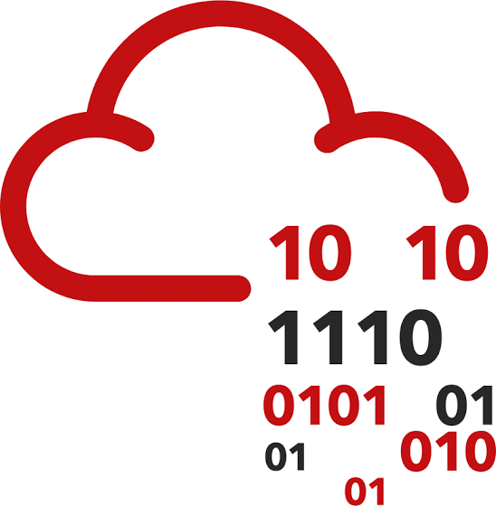

# Meghan Tashi // Security Researcher

[ SESSION ACTIVE ] / OPERATOR PROFILE

<h1>Cyber Security Analyst</h1>

Security researcher focused on web application, API, Android, and network penetration testing. I build practical tooling, document exploitability clearly, and turn technical findings into useful remediation guidance.

[VIEW EXPERIENCE](#experience) · [SECURITY NOTES](android/index.md)

<section class="profile-section" aria-labelledby="public-profiles-title">

<h2 id="public-profiles-title">Public profiles</h2>

<a class="profile-card" href="https://app.hackthebox.com/" rel="noopener" target="_blank">

<strong>Hack The Box</strong>
<small>Labs, challenges, and security practice</small>

-&gt;
</a>

<a class="profile-card" href="https://tryhackme.com/" rel="noopener" target="_blank">

<strong>TryHackMe</strong>
<small>Guided rooms and hands-on learning</small>

-&gt;
</a>

</section>

**04**  
**CORE DOMAINS**  
Web · API · Android · Network

**VAPT**  
**FIELD WORK**  
Assessment · Exploitation · Retesting

**C|PENT**  
**CERTIFIED**  
EC-Council

## Operating focus

### Web / API

Reconnaissance, enumeration, access control, injection, authentication, and business-logic testing.

### Android

APK analysis, manifest review, insecure storage, IPC, Frida instrumentation, and mobile traffic analysis.

### Reporting

Reproducible PoCs, impact analysis, remediation guidance, client communication, and retesting.

## Certifications

`C|PENT` **Certified Penetration Testing Professional** · EC-Council

## Experience

### Junior Cyber Security Analyst

**ShieldByte Infosec Pvt. Ltd. · Mumbai, India**  
**Dec 2025 — Present**

- Conduct end-to-end Vulnerability Assessment and Penetration Testing (VAPT) across web applications, APIs, Android applications, and network infrastructure for multiple clients.
- Exploit vulnerabilities to develop proof-of-concept demonstrations showing real-world business impact and risk exposure.
- Engage directly with clients throughout assessments: scoping engagements, clarifying requirements, and presenting findings and remediation guidance.
- Author detailed technical reports covering reproduction steps, payloads, impact analysis, and mitigation recommendations.
- Perform retesting and validation to confirm effective remediation and secure closure of identified vulnerabilities.

### Security Researcher (Intern)

**VRSECLabs · Remote**  
**Oct 2025 — Dec 2025**

- Conducted comprehensive web application penetration tests against private, authorized targets to identify vulnerabilities and assess exploitability.
- Designed and executed custom reconnaissance, enumeration, and exploitation workflows using advanced tools and scripting to improve coverage.
- Documented findings with clear technical reports and collaborated with developers on vulnerability triage and secure coding initiatives.

## Projects

### Hacker Methodology Manager

**Personal project · May 2026 — Present**

- Developed a centralized tool to organize and track offensive security methodologies and testing checklists.
- Implemented tagging and categorization for Web, Active Directory, Privilege Escalation, and related domains.
- Built core search functionality with a lightweight, offline-first interface for portable field use.
- Planning a local database backend, user-defined modules, and real-time synchronization for collaborative workflows.

### An Exploitable App

**Final year diploma project · Jun 2022 — Mar 2023**

- Developed an intentionally vulnerable full-stack web application for demonstrating and testing common web security flaws.
- Incorporated Cross-Site Request Forgery, open redirects, sensitive data exposure, and missing access control vulnerabilities.
- Conducted manual and tool-based assessments to validate exploitability and demonstrate impact.
- Published in the peer-reviewed *International Research Journal of Modernization in Engineering, Technology and Science*, Volume 5, Issue 2, February 2023.

## Education

### Bachelor of Engineering, Computer Engineering

**2023 — 2026** · **GPA: 7.5/10**  
VPPCOE

### Diploma, Computer Engineering

**2020 — 2023** · **GPA: 8.7/10**  
AISSMS Polytechnic, Pune

## Certifications

- **Certified Penetration Testing Professional (C|PENT)** — EC-Council

## Publication

**Tashi, M. et al. An Exploitable App.** *International Research Journal of Modernization in Engineering, Technology and Science*, 5. Peer-reviewed, open access, fully refereed journal. Impact Factor: 7.868, pages 1–4, ISSN: 2582-5208, February 2023.

[Read the publication](https://www.irjmets.com/uploadedfiles/paper//issue_2_february_2023/33924/final/fin_irjmets1678126362.pdf)

## Skills

### Cybersecurity

Web application pentesting | Network pentesting | API security | Android security | Vulnerability assessment | OWASP Top 10 | Reconnaissance | Enumeration | Exploitation | Privilege escalation

### Systems and scripting

Linux (Kali, Ubuntu) | macOS | Bash scripting | VirtualBox | VMware

### Tools

Postman | Visual Studio Code | Notion | Nessus | MobSF | Frida | Objection | ADB | Apktool | Burp Suite | Caido | Nmap | SQLMap | ffuf | Nuclei

### Soft skills

Problem solving | Initiative | Time management | Communication | Teamwork

