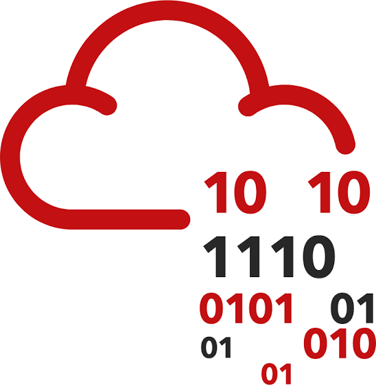

~/notes $ cat README.md

<h1>Hacking Notes</h1>

Field notes on web, API, Android and network penetration testing: checklists, commands and write-ups for authorized assessments, kept short enough to find fast.

<a class="home-btn home-btn--primary" href="android/">./start-with-android.sh</a>
<a class="home-btn" href="#popular-pages">./popular-pages.sh</a>

by <a href="about/">Meghan Tashi</a> · 0x3xp10i73r

bash — man notes

$ man notes

USAGE

<kbd>/</kbd>search every page

<code>./area/</code>browse by area from the sidebar

<code>[copy]</code>every command block is copy-paste ready

SCOPE

<code>authorized</code>targets only. no exceptions.

$ _

<section class="home-section" aria-labelledby="popular-pages">

<h2 id="popular-pages">Start here</h2>

New here? These pages follow the order an Android assessment runs.

<ul class="home-jump">
<li><a href="android/setup/">android/setupInstall order for the JDK, emulator, ADB and tooling, plus device sanity checks.</a></li>
<li><a href="android/manifest/">android/manifestRead AndroidManifest.xml first: permissions, exported components, backup and network policy.</a></li>
<li><a href="android/static-analysis/">android/static-analysisHardcoded secrets, weak cryptography, hybrid and native apps, obfuscation and integrity checks.</a></li>
<li><a href="android/network-interception/">android/network-interceptionProxy an app through ADB, and what to do when certificate pinning gets in the way.</a></li>
<li><a href="android/frida/">android/fridaStart frida-server, write a basic Java hook, then discover and trace methods.</a></li>
<li><a href="android/dynamic-analysis/">android/dynamic-analysisLocal storage, logging, WebViews, intents and deep links on a running app.</a></li>
<li><a href="android/pentesting-checklist/">android/pentesting-checklistGrouped checks to record evidence against, build by build.</a></li>
<li><a href="android/reporting/">android/reportingThe fields to capture for every confirmed issue.</a></li>
</ul>

</section>

<section class="home-section" aria-labelledby="browse-areas">

<h2 id="browse-areas">Browse by area</h2>

<a class="home-area" href="android/">
./android-mobile/26 notes
APK anatomy, static and dynamic analysis, Frida, traffic interception, a checklist and a report template.
</a>

<a class="home-area" href="web/">
./web-app-security/1 write-up
Write-ups shaped like a client report: target, reproduction steps, impact and remediation.
</a>

<a class="home-area" href="tools/">
./tools-cheatsheets/growing
Recon and fuzzing one-liners, expanded as they get used.
</a>

<a class="home-area" href="api/">
./api-security/planned
REST and GraphQL testing, mapped to the OWASP API Security Top 10.
</a>

<a class="home-area" href="network/">
./network-security/planned
Enumeration through post-exploitation: SMB and NTLM, Active Directory, pivoting.
</a>

<a class="home-area" href="bug-bounty/">
./bug-bounty-writeups/planned
Publicly disclosable findings, published only where the program allows it.
</a>

</section>

<section class="home-section" aria-labelledby="ground-rules" markdown="1">

<h2 id="ground-rules">Ground rules</h2>

!!! warning "Authorized testing only"
    Everything here is for systems you own or have written permission to test. These are working notes, not gospel: verify before you rely on them.

</section>

<section class="profile-section" aria-labelledby="public-profiles-title">

<h2 id="public-profiles-title">Public profiles</h2>

<a class="profile-card" href="https://app.hackthebox.com/" rel="noopener" target="_blank">

<strong>Hack The Box</strong>
<small>Labs, challenges, and security practice</small>

-&gt;
</a>

<a class="profile-card" href="https://tryhackme.com/" rel="noopener" target="_blank">

<strong>TryHackMe</strong>
<small>Guided rooms and hands-on learning</small>

-&gt;
</a>

</section>